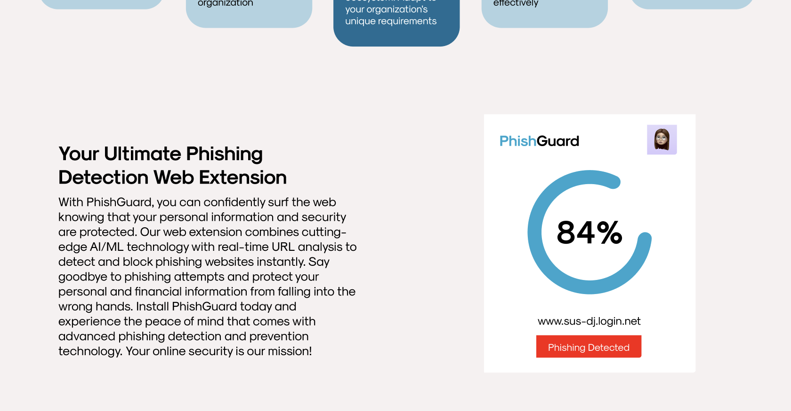
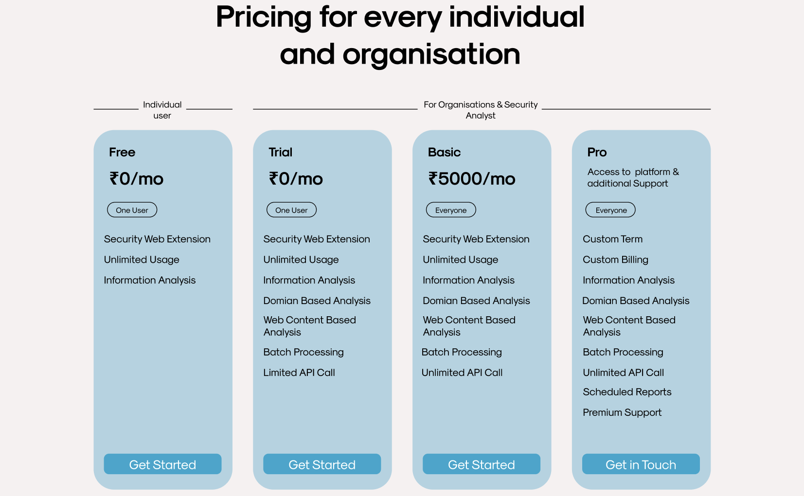

# PhishGuard

PhishGuard is a web application designed to provide robust protection against phishing attacks. This repository contains the frontend of the home page of the PhishGuard website.

## Preview

